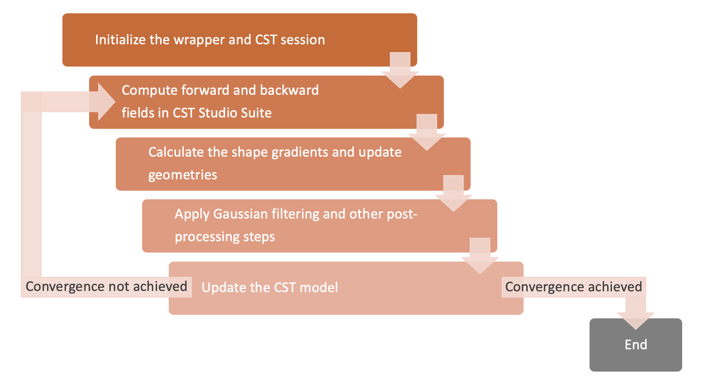

# Microwave Device Optimization via Adjoint-Based Shape Sensitivity and Level Set Evolution

## Introduction

This repository contains the full Python implementation of an optimization framework for planar microwave devices using adjoint-based sensitivity analysis and level set shape evolution. The project is integrated with CST Studio Suite 2022 and written in Python 3.6.8.

This framework automates and acclerates the design of planar microwave structures like couplers and resonators while meeting PCB fabrication constraints.

## Overview



The diagram shows the overall pipeline:

- CST forward and adjoint simulations
- Shape sensitivity evaluation using the adjoint method 
- Level set boundary update  
- Gaussian smoothing and other post-processing steps for layout correction
- CST model update and loop iteration

## Installation Instructions

1. **Clone this repository:**

   ```bash
   git clone https://github.com/FangruLin144/Y3_individual_project.git
   cd Y3_individual_project
   ```

2. **Install Python dependencies:**

   This project uses standard scientific Python libraries. You can install them via:

   ```bash
   pip install numpy scipy pandas matplotlib h5py
   ```

   > No external `cst` package is installed via pip — instead, this code interfaces directly with CST Studio Suite through its COM automation.

3. **Set up CST COM automation:**

   - CST Studio Suite 2022 or later must be installed on a Windows machine.

   - VBA scripting and COM automation must be enabled in CST (default).

   - Test the COM interface using the notebooks in `interface_setup/`. These setup notebooks verify the COM interface by connecting to CST and running a toy example in the same directory.

## Directory Overview

Here is an overview of the framework structure and essential tools to properly implement the framework. 

```
Y3_individual_project/
│
├── README.md
│
├── main.ipynb                  # Top-level notebook to launch and explain the workflow
│
├── src/                        # Core optimization pipeline
│   ├── optimizer/                       # Optimization engine (level set and sensitivity logic)
│   │   ├── level_set_engine.py          # Handles level set evolution and shape updates
│
│   ├── cst_interface/                   # CST-related scripting and model interfacing
│   │   ├── geometry_interface.py        # CST model construction and updates
│   │   ├── data_writer.py               # CST field and geometry export functions
│   │   ├── field_data_loader.py         # Extracts field data from CST results
│   │   └── project_cloner.py            # File duplication and template preparation
│
│   ├── filters/                         # Manufacturability post-processing tools
│   │   ├── filter.py                    # Applies smoothing to geometry, including Gaussian filters
│
│── results/                    # Stores field results across iterations
│
│── shape_history/              # Stores shape evolution across iterations
│
├── interface_setup/            # CST COM config and test notebooks
│   ├── cst_package_setup.ipynb
│   ├── cst_test.ipynb
│   └── example                          # An example CST project to test environment configuration
│
├── tools/                      # Auxiliary tools for inspecting and analyzing simulation results
│   ├── view_e_field.ipynb               # Extracting and visualizing electric fields with time-domain solvers
│   ├── view_h_field.ipynb               # Extracting and visualizing magnetic fields with time-domain solvers
│   ├── view_e_field_fsolver.ipynb       # Extracting and visualizing electric fields with frequency-domain solvers
│   ├── view_h_field_fsolver.ipynb       # Extracting and visualizing magnetic fields with frequency-domain solvers
│   ├── extract_s_parameters.ipynb       # Extracting and visualizing S parameters throughout iterations
```

## Key Equations for the Framework

- **Adjoint-based shape derivative:**

  ```math
  \frac{d \mathcal{L}}{d \boldsymbol{p}} = \frac{dJ}{d\boldsymbol{p}} = \Re \left\{ -j\omega \int_{\Gamma_{\text{PEC}}} \left( \varepsilon \boldsymbol{E} \cdot \boldsymbol{E}^{\text{adj}} + \mu \boldsymbol{H} \cdot \boldsymbol{H}^{\text{adj}} \right) \, ds \right\}
  ```

- **Level set boundary evolution:**

  ```math
  \frac{\partial \Phi}{\partial t} + V |\nabla \Phi| = 0
  ```

- **Gaussian filtering:**

  ```math
  G(x) = \frac{1}{2\pi \sigma^2} \exp\left( -\frac{x^2}{2\sigma^2} \right)
  ```

## Known Issues and Future Improvements

- **Platform dependency:** Windows-only due to CST COM interface 

- **CST startup delay:** Initial launch may take up to 15 seconds  

- **Level set CFL condition:** Time step must be manually tuned to avoid instability, as the level set engine is not automatically constrained to satisfy the Courant–Friedrichs–Lewy (CFL) condition

- **Filter tuning:** Gaussian filter parameter σ requires empirical tuning per device

## Future Plans

- Automate CST field data extraction

- Parallelize CST simulation calls

- Integrate filtering into the optimization loop

- Improve directory abstraction for broader device compatibility

## Contact

Please raise issues or suggestions through the [GitHub Issues tab](https://github.com/FangruLin144/Y3_individual_project/issues).
